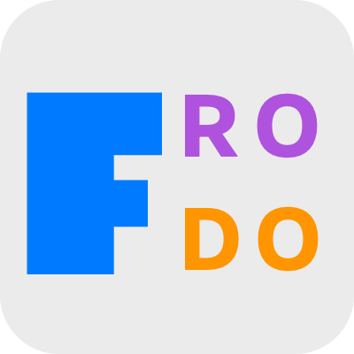

# Frodo

Frodo is a collection of scripts that facilitates the process of creating, managing and running SAM projects. With Frodo, you can create, remove, or archive your projects; in addition, Frodo offers some tools to interact with the projects itself, e.g., running and reconfiguring them, if needed.

For the documentation, please visit [here](https://sam.amirmasoudabdol.name/frodo/frodo.html).

You can find our pre-print on [PsyArXiv](https://psyarxiv.com/zy29t).